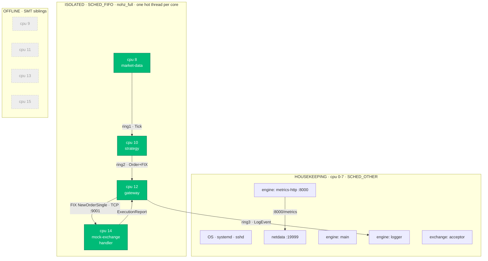

# CppTradeSimulation & Operations Automation

A low-latency **C++20 trading engine** — a lock-free, 3-hop pipeline pinned to
isolated CPU cores on bare-metal Linux — together with the **Ansible automation**
that tunes the box, deploys the workload, monitors it, and gates the market open
with Beginning-of-Day checks. Built to exercise the HFT C++ and Linux
low-latency skill set end to end.

> **Honest framing:** the *engine, isolation, measurement, and automation are
> real and run on bare metal* (AMD Ryzen 7 7730U, isolated cores, invariant TSC,
> explicit huge pages, `SCHED_FIFO`). The transport is loopback TCP (not a real
> exchange link), so the round-trip number includes the mock exchange + kernel —
> the number the engine *owns* is the in-process tick-to-trade (`t2t`). See
> [`ProjectDeepDive.md`](ProjectDeepDive.md) §6 and §17.

---

## Headline numbers (bare metal, isolated cores, `performance` governor)

**Engine tick-to-trade** (`t2t` — tick generated → order ready to send, 100%
in-process):

| p50 | p99 | p999 | max |
|---|---|---|---|
| **588 ns** | **1.58 µs** | **2.0 µs** | 2.5 µs |

**Round trip** (`rtt` — tick → fill, includes the mock exchange + kernel TCP):
p50 43 µs · p99 59 µs · p999 67 µs. The ~70× gap is the kernel/TCP cost — the
live motivation for kernel bypass.

**Microbenchmark A/B** (why the banned constructs are banned):

| dispatch CRTP vs `virtual` | alloc pool vs `malloc` | map flat vs `unordered_map` |
|---|---|---|
| 0.46 → 0.94 ns (**2.06×**) | 2.88 → 12.58 ns (**4.36×**) | 1.02 → 1.67 ns (**1.64×**) |

---

## Architecture

```
┌── LAPTOP (bare metal, Ubuntu 22.04) ──────────────────────────────────────┐
│  Housekeeping cpu 0-7              Isolated cpu 8,10,12,14 (phys cores 4-7) │
│   ├ OS / systemd / netdata          ├ market-data ─ring1─▶ strategy        │
│   ├ engine: logger + metrics-http   │      (cpu8)          (cpu10)          │
│   └ Ansible (control plane)         │                         │ ring2       │
│                                     │                         ▼             │
│   SMT siblings 9,11,13,15 OFFLINE   ├ mock-exchange ◀─FIX/TCP─ gateway      │
│                                     └   (cpu14)     :9001     (cpu12)        │
│   engine :8000/metrics  ──▶ netdata :19999                                  │
└────────────────────────────────────────────────────────────────────────────┘
```

Four planes: **control** (Ansible), **data** (C++ engine + mock exchange),
**monitoring** (netdata), **readiness** (BOD checks). One hot thread per isolated
physical core; SPSC lock-free rings between hops; non-hot threads on housekeeping.
Ansible runs on the node itself (`inventory/local.yml`), or from any separate
control host over SSH (`inventory/hosts.yml`).

### Live core map — what runs on each logical CPU



The `t2t` metric covers `cpu8 → cpu10 → cpu12` (in-process, ~0.6 µs); `rtt` adds
the `cpu12 ⇄ cpu14` loopback FIX hop (~43 µs). Cores 9/11/13/15 are offlined so
each hot thread owns a full physical core.

---

## Repository structure

```
├── ansible.cfg                    # inventory, roles path, become=sudo, YAML output
├── inventory/
│   ├── local.yml                  # run the playbook on the node itself (default)
│   └── hosts.yml                  # or from a separate control host over SSH (edit host/user)
├── playbooks/site.yml             # runs the 4 roles (tagged: kernel/monitoring/app/bod)
├── roles/
│   ├── kernel-tuning/             # isolcpus/nohz/rcu/hugepages, RT-throttle off, SMT-offline oneshot
│   ├── monitoring-agent/          # netdata (apt), localhost bind, per-core CPU
│   ├── trading-app-deploy/        # trader user, CMake build, systemd units (RT/caps/affinity)
│   │   └── files/cpp/             # ← the C++20 engine + mock exchange (see cpp/README.md)
│   └── bod-checks/                # readiness script + config + systemd timer
├── scripts/latency_demo.sh        # tc/netem latency-injection demo
├── INTERVIEW_NOTES.md             # every C++ topic → file map + talking points
├── ProjectDeepDive.md             # full design/measurement/war-stories study guide
└── README.md
```

The C++ lives in [`roles/trading-app-deploy/files/cpp/`](roles/trading-app-deploy/files/cpp/)
— 13 headers + 2 binaries + a microbench; see its
[README](roles/trading-app-deploy/files/cpp/README.md).

---

## Quickstart

**Build & run the engine locally** (no isolation needed — pins to whatever cores exist):

```bash
cd roles/trading-app-deploy/files/cpp
cmake -S . -B build -DCMAKE_BUILD_TYPE=Release && cmake --build build -j
./build/mock_exchange --pin=off &
./build/trading_engine --huge=off --pin=on --rt=off --rate=2000
curl -s localhost:8000/metrics | grep engine_t2t     # tick-to-trade percentiles
taskset -c 6 ./build/microbench                        # the A/B numbers
```

**Full deploy with tuning** (bare metal; needs sudo, reboot once for GRUB isolation):

```bash
ansible-playbook -i inventory/local.yml playbooks/site.yml --tags kernel -K   # isolation
sudo reboot                                                                    # activate isolcpus/hugepages
ansible-playbook -i inventory/local.yml playbooks/site.yml -K                  # build + deploy + monitor
```

Verify: `cat /proc/cmdline` (isolation params), `lscpu -e` (9/11/13/15 offline),
`bod_check.sh` (READY), `curl localhost:8000/metrics`, netdata at
`http://127.0.0.1:19999`.

---

## Runtime A/B toggles (no rebuild)

| flag | effect |
|---|---|
| `--dispatch=crtp\|virtual` | strategy call: inlined CRTP vs vtable |
| `--alloc=pool\|malloc` | per-order scratch: object pool vs `operator new` |
| `--huge=on\|off` | hot state on 2 MB huge pages vs regular heap |
| `--pin=on\|off` `--rt=on\|off` | affinity + `SCHED_FIFO` |
| `--rate=N` | synthetic ticks/sec |

---

## The two live demos

- **Latency injection** — `sudo ./scripts/latency_demo.sh on` adds `netem`
  delay on loopback; `rtt` on the dashboard jumps ~10 ms (`t2t`, the engine
  path, is unaffected — the point). `off` restores baseline.
- **Failover / self-heal** — `sudo systemctl kill -s SIGKILL trading-engine` →
  systemd restarts it in ~2 s; a clean `systemctl stop` leaves it down and
  `bod_check.sh` returns **NOT READY (exit 2)** — the readiness gate.

---

## Engine metrics (`:8000/metrics`)

`engine_t2t_{p50,p99,p999,max,mean}_ns` (**engine tick-to-trade** — the number we
optimise), `engine_rtt_{…}_ns` (round trip incl. exchange), `engine_orders_total`
/ `engine_fills_total` (counters), `engine_tsc_ghz`, `engine_hugepages`. Standard
Prometheus text — plugs into Prometheus+Grafana unchanged.

---

## Mapping to the role

| Responsibility | Evidence |
|---|---|
| **C++ (core skill)** | 13-header lock-free C++20 engine: SPSC rings, HDR histogram, object pool / arena / huge-page arena, CRTP-vs-virtual, hand-rolled FIX, `pthread` affinity + `SCHED_FIFO` |
| Low-latency infra | isolcpus/nohz_full/rcu_nocbs, explicit hugepages, RT-throttle disabled, SMT-offline, performance governor, per-core pinning |
| Automation (Ansible) | 4 idempotent roles, two inventories, tags, `--check`/`--diff`, handlers |
| Kernel tuning | full boot + sysctl knob set, applied and verified |
| BOD checks | readiness role + timer; 15-pass gate incl. isolation/TSC/hugepages-in-use |
| Monitoring & alerting | netdata per-core + engine `:8000/metrics`; BOD exit codes |
| Latency troubleshooting | `perf`/`strace`/microbench methodology; documented war stories |
| High availability | `Restart=on-failure` self-heal |
| Python & Bash | Ansible + `bod_check.sh` / `latency_demo.sh` / `trade-ops-cpu-tuning.sh` |

---

## Honest limitations

- **Loopback TCP, not a real NIC** — no kernel bypass (ef_vi/DPDK/AF_XDP); the
  `t2t`↔`rtt` gap *is* the kernel-stack cost. The `rtt` number includes the mock
  exchange, which you'd never own in production; the engine's own number is `t2t`.
- **Single socket** — no real NUMA. **Not PREEMPT_RT** (kernel is
  PREEMPT_DYNAMIC). **Netdata (apt) lacks the go.d plugin**, so engine metrics
  are read from `:8000` directly; the per-core CPU dashboard works.
- The mock exchange doesn't enforce FIX sequence numbers or risk checks.

Production adds: real NIC IRQ affinity, kernel bypass, PREEMPT_RT/tickless,
NUMA-aware placement, PTP time sync, redundant paths + sub-ms failover.

---

## Tech stack

C++20 (GCC, CMake) · Ansible · Netdata · systemd · chrony · `tc/netem` ·
`perf`/`strace` · Linux CPU isolation · Git.

**Docs:** [`RUNBOOK.md`](RUNBOOK.md) — start/stop, dashboard, BOD, self-heal, and
demos, command-first · [`ProjectDeepDive.md`](ProjectDeepDive.md) — full design,
rdtsc/metrics methodology, A/B data, debugging war stories ·
[`INTERVIEW_NOTES.md`](INTERVIEW_NOTES.md) — interview-topic → file map.
